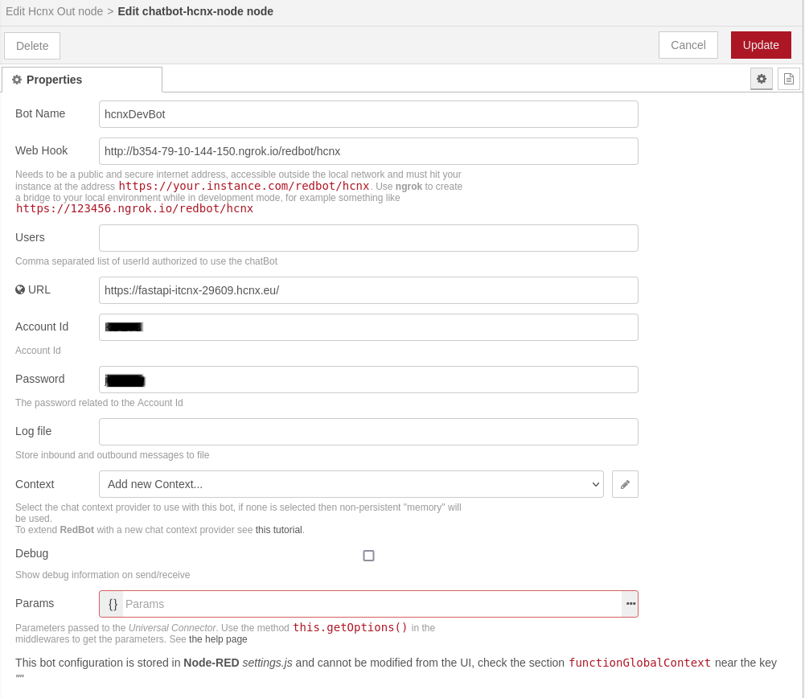

# node-red
[Installiamo node-red dai sorgenti](https://nodered.org/docs/getting-started/development)

```
git clone https://github.com/node-red/node-red.git
```
This will create a directory called `node-red` in the current directory that contains the full source code of the project. The rest of these instructions assume you are inside that directory.

Once you are on main branch, you should install all of the dependencies with the command:
```
npm install
```

You can then run Node-RED using the command:
```
npm start
```

## node-red-contrib-hcnx
```
git clone https://github.com/ilpise/node-red-contrib-hcnx.git
```
This will create a directory called `node-red-contrib-hcnx` in the current directory that contains the full source code of the project. The rest of these instructions assume you are inside that directory.

Once you are on main branch, you should install all of the dependencies with the command:
```
npm install
```

[Add `node-red-contrib-hcnx` to `node-red`](https://nodered.org/docs/creating-nodes/first-node#testing-your-node-in-node-red)
go to the node-red user directory, typically `~/.node-red`

installiamo il pacchetto

```
user@machine:~/.node-red$ npm install ~/path_to/node-red-contrib-hcnx
```

# Usage

## Simple flow to echo messages

Questo semplice flusso permete di spedire un messaggio e di ricevere indietro il testo inviato


Per configurare il BOT facciamo un doppio click su uno dei due nodi e compare questa schermata


per configurare in ambiente di _development_ cliccare sull'icona penna di fianco a _Add nex chatbot-hcnx-node_

settiamo i parametri come in figura




- _Bot Name_  è un nome di riferimento, può essere qualsiasi.

- _Web Hook_ serve per gli incoming messagges espone la route `redbot/hcnx`, per i test in locale possiamo rendere la route pubblica usando **ngrock**

  Per utilizzarlo con hcnx in node HcnxInNode bisogna lanciare

  ```
  ngrok http localhost:1880
  ```

  ed inseriamo la url che compare

  


- _URL_ _Account Id_ e _Password_ servono per gli outcoming messages per creare la url come definito nella documentazione di **FastApi**
